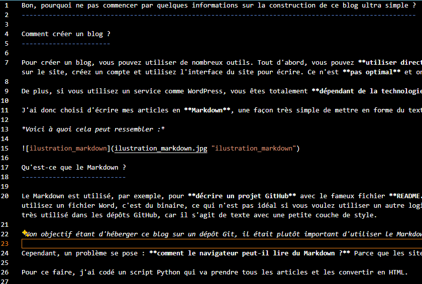
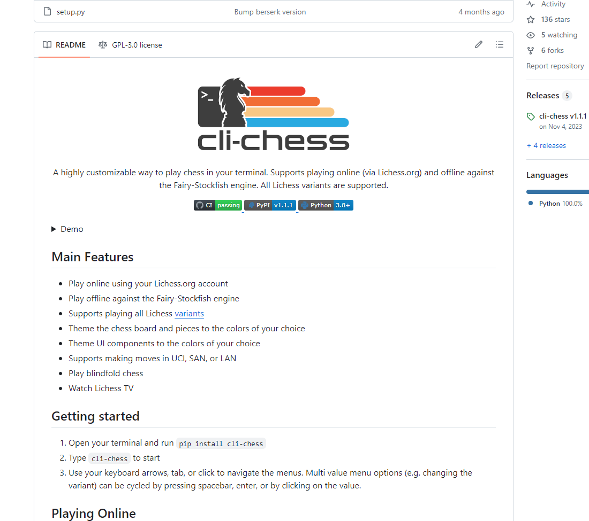

Bon, pourquoi ne pas commencer par quelques informations sur la construction de ce blog ultra simple ?
------------------------------------------------------------------------------------------------------

Comment créer un blog ?
-----------------------

Pour créer un blog, vous pouvez utiliser de nombreux outils. Tout d'abord, vous pouvez **utiliser directement un site web d'une enteprise** qui propose de la création et hebergement de blogs, mais ce n'est pas très amusant. Une fois sur le site, créez un compte et utilisez l'interface du site pour écrire. Ce n'est **pas optimal** et on ne **maîtrise pas vraiment le rendu final** que l'on souhaite obtenir. Donc, je ne recommande pas cette option.

De plus, si vous utilisez un service comme WordPress, vous êtes totalement **dépendant de la technologie**. Si dans 5 ans, le service disparaît, vous serez dans la sauce.

J'ai donc choisi d'écrire mes articles en **Markdown**, une façon très simple de mettre en forme du texte. Ce n'est pas très élaboré, mais c'est efficace.

## *Voici à quoi cela peut ressembler :*

Qu'est-ce que le Markdown ?
---------------------------

Le Markdown est utilisé, par exemple, pour **décrire un projet GitHub** avec le fameux fichier **README.md**. L'avantage, c'est qu'on a notre **mise en page stockée dans un fichier texte**. Cela peut sembler basique, mais si vous utilisez un fichier Word, c'est du binaire, ce qui n'est pas idéal si vous voulez utiliser un autre logiciel que Word ou si vous voulez créer différentes versions de votre fichier texte avec **Git**. C'est pourquoi le Markdown est très utilisé dans les dépôts GitHub, car il s'agit de texte avec une petite couche de style.

## *Exemple de redame sur github pour voir comment cela peut rendre*

*Mon objectif étant d'héberger ce blog sur un dépôt Git, il était plutôt important d'utiliser le Markdown.*

Cependant, un problème se pose : **comment le navigateur peut-il lire du Markdown ?** Parce que les sites web sont des pages HTML. La réponse est simple : **il ne peut pas**. Il faut donc **convertir le Markdown en HTML**.

Pour ce faire, j'ai codé un script Python qui va prendre tous les articles et les convertir en HTML.

Ce script est lancé automatiquement avec des GitHub Actions, des ordinateurs qui se lancent automatiquement sur les serveurs de GitHub afin d'effectuer des actions sur mon code. Dans mon cas, dès que je fais une mise à jour sur la branche principale, le script est lancé sur les serveurs de GitHub, et le nouveau code converti en HTML depuis le Markdown est directement envoyé sur une autre branche.

### Voici le fichier build.py qui me convertie mes articles en markdown en html

[build.py](https://github.com/yvan-allioux/blog/blob/main/build/build.py)

### et voici le github action qui automatise le lancement du script

[github action](https://github.com/yvan-allioux/blog/blob/main/.github/workflows/python-app.yml)

Et pour l'hébergement ?
-----------------------

GitHub dispose d'une fonctionnalité appelée GitHub Pages, qui permet de mettre à disposition des fichiers HTML, JavaScript et CSS sur le web directement depuis votre dépôt.

Il suffit donc d'exposer la branche résultant de notre construction.

Les avantages de tout cela :
----------------------------

Finalement, j'aurais pu créer un compte WordPress en 10 minutes, mais ici, je maîtrise de A à Z l'écriture, le rendu, l'hébergement et plein d'autres choses intéressantes. Si vous voulez quelque chose de purement fonctionnel, ce n'est peut-être pas la solution la plus efficace, mais si vous êtes un développeur qui souhaite pouvoir bricoler et automatiser plein de choses, cela fait sens.

### Le code est bien sûr open source [ici](https://github.com/yvan-allioux/blog/).

Normalement il suffit de faire un fork du projet et d'activer GitHub Page et c'est bon vous avez votre propre blog 🤠
