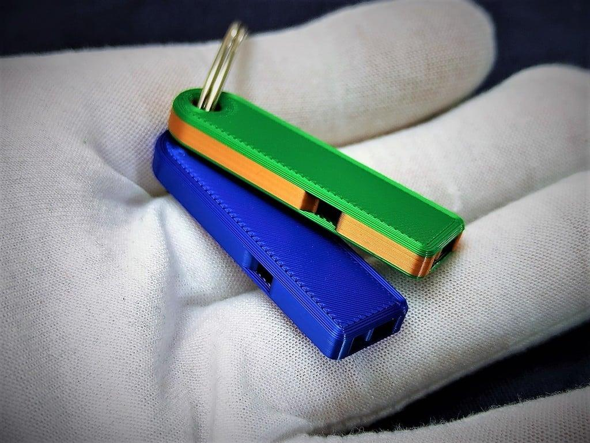

### **Sélection de trucs à imprimer en 3d trouver sur le net**

J'ai acheté ma première imprimante 3D en 2016 ça commence à faire un certain temps à l'époque c'était vraiment une technologie de niche il fallait vraiment bricoler pour fabriquer et bidouiller sa machine. Je me souviens que le tapis chauffant de ma première imprimante (une Anet a8 si je me souviens bien), s'est mis à ne plus fonctionner ... pas de problème, un Arduino qui regarde la valeur de la thermoresistance du tapis et un relais qui allume ou éteint une vieille Aline de PC brancher directement sur le tapis afin d'envoyer un max de courant 

Un relais payer probablement un euro sur Aliexpress et des fils d'alimentation sans gaine … bon ça a pas pris feu ¯⁠\⁠_⁠(⁠ツ⁠)⁠_⁠/⁠¯ 

Mais bon trêve d'anecdotes, voici ma sélection des meilleurs modèles 3D trouvé sur le net que j'ai pu imprimer 

En général des choses imprimables en moins de 4 heure ou composé de pièces imprimables en moins de 4 heures 

Toujours imprimer en PLA sur mon imprimante ender 3 V2 par défaut tout ce que je vous présente ici et imprimer avec un remplissage de 20 % avec un remplissage cubique et trois couches pour les murs, pour les petits objets privilégiés un remplissage entre 50 et 70 %

--------------------------------------------------------------------------------------

On commence avec un sifflet porte-clé tout petit pas besoin de support très rapide très simple

### Lien : [Loud and compact Whistle for your Keychain](https://www.thingiverse.com/thing:5846855).

Ensuite une boîte pour des cartes à jouer tout à fait classique, pas mal pour remplacer les boîtes en carton qui se détruisent au fil des parties

Un jeu d'échec 

Des petites boîtes très sympathiques plutôt solide toujours sans support, elles ont l'air résistante pour ranger les cartes SD ou autre c'est sympa

Dans la catégorie ça s'imprime vite, un rafale, il doit y avoir une dizaine d'avions de chasse en format carte comme ça qu'on a juste à découper rapidement et emboîter afin d'avoir quelque chose un petit peu en relief, en plus il y a un trou un peu près à l'endroit équilibré ce qui fait qu'avec un fil de fer ou une ficelle vous pouvez les suspendre, tellement rapide et facile pour faire un cadeau le format carte comme ça c'est super il y a un petit côté puzzle avec le montage pour la personne à qui on l'offre

Un cryptex, en gros une boîte avec un mot de passe, c'est l'une des premières choses que j'ai imprimé, ça fonctionne vraiment bien quasiment impossible de l'ouvrir sans connaître le code et sans utiliser un marteau, je conseille l'huile de silicone pour lubrifier ce genre de pièce le WD40 n'est pas forcément adapté 

Dans le même genre que l'objet précédent on a une protection pour une clé USB 

Un petit porte-clé glock, adorable (ou pas) peut très bien s'imprimer avec une toute petite taille et ça c'est sympa

Petit pendentif tortue, en soit ça n'a pas grande valeur mais à offrir ça passe partout 

Laisser tomber le hand spinner, le fidget cube est bien plus satisfaisant, je trouve que c'est l'un des meilleurs trucs à imprimer en 3D ça permet de s'occuper les mains vraiment à tester, une taille de 80 % et un remplissage de 50 % c'est optimale 

Un taser fait maison 

Je pense que ça se passe de commentaires mais c'est rigolo à fabriquer

Un stylo tournevis pour différents embouts, plutôt pratique à emporter tous les jours dans sa trousse, imaginez vous vous baladez dans la rue et vous avez besoin d'un embout de vis torx, et bah là plus d'excuse

Une boîte pour les batteries format 18650, assez résistant et la batterie ne se balade pas dedans 

Et pour finir un personnage totalement articulé super facile à imprimer même en PLA, je conseille quand même l'huile de silicone pour lubrifier les articulations

Merci d'avoir lu cet article j'espère que vous avez trouvé des trucs cool imprimer :)
    