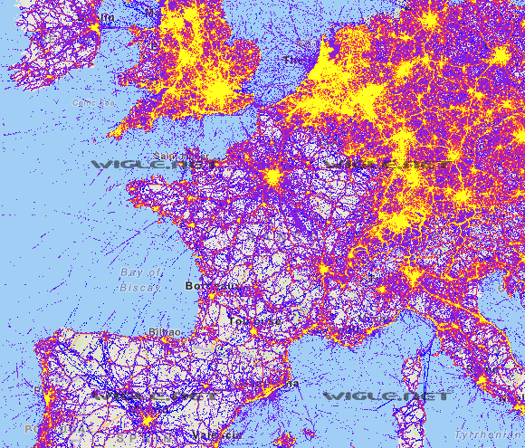
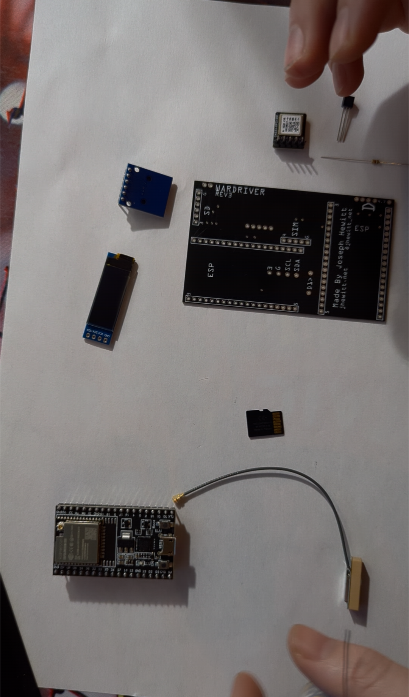
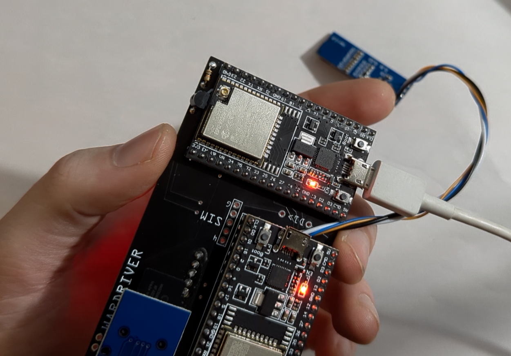
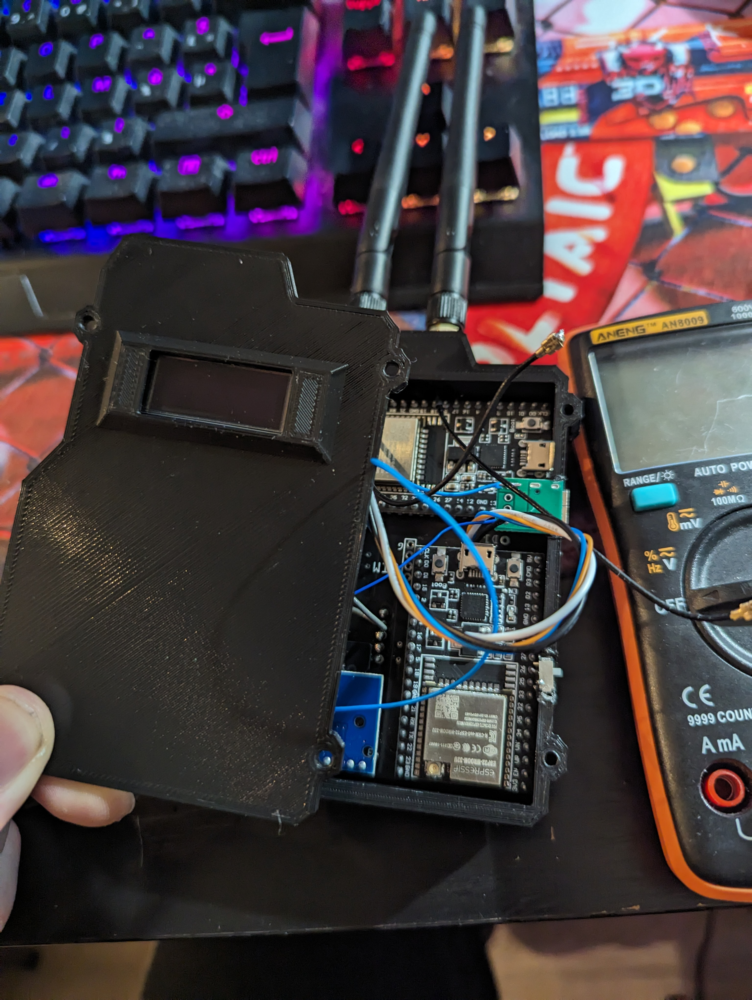
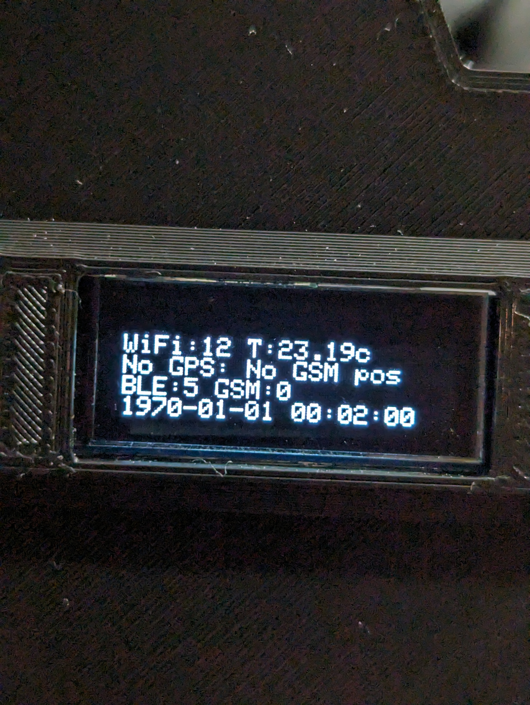
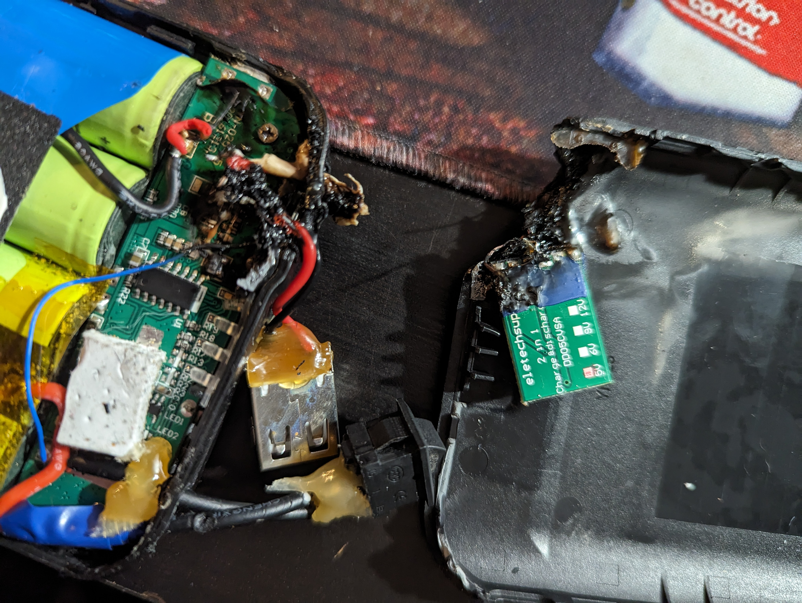
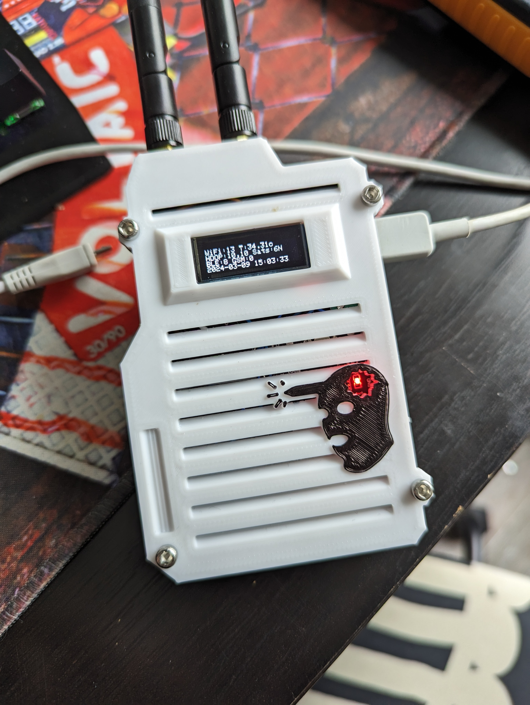
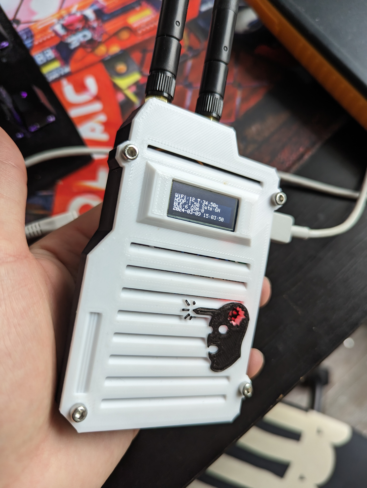

### **Le Wardriving**

Aujourd'hui on va faire du wardriving, mais qu'est-ce que c'est ? Et bien la première fois que j'en ai entendu parler j'ai pas vraiment trop compris l'utilité (spoiler : je n'en ai pas l'utilité mais c'est rigolo vous allez voir) en fait cela consiste en un scan des réseaux Wi-Fi autour de vous, un peu comme quand vous allez dans vos paramètres pour rechercher un réseau Wi-Fi et ben vous avez le nom de vos wifi et du wi-fi de vos voisins 

Et bien là on va faire la même chose mais de façon un peu plus … efficace 

L'objectif est de cartographier tous les réseaux autour de vous avec le couple de données adresse MAC et nom du Wi-Fi ainsi que sa position GPS et son protocole de chiffrement. En utilisant un équipement adapté et en vous déplaçant vous pouvez par exemple enregistrer dans une base de données la géolocalisation et les protocoles de chiffrement de tous les réseaux WiFi de votre quartier. 

Donc wardriving : pratique consistant à scanner les réseaux sans fil autour de nous, un wardriver : objet permettant ce scan

Certaines personnes malveillantes utilisent ces techniques pour trouver des wifi avec d'anciennes technologies facilement piratable, mais bon vous vous doutez bien que si je fais un article de blog là dessus c'est que ce n'est pas vraiment l'objectif ici, l'objectif va être de cartographier le réseau juste pour le fun d'avoir des informations et une vision que les autres personnes n'ont pas 

De plus on peut également capter les téléphones et adresse bluetooth lorsque c'est activé donc on a également la vision des téléphones et appareil bluetooth situé autour de nous dans notre base de données, si quelqu'un vous stalk vous allez le voir dans la base de données 

Bref c'est super j'avoue que c'est pas très utile mais c'est rigolo, certaines personnes ont pour objectif d'envoyer toutes ces données sur le site web [wigle.net](http://wigle.net) qui est une base de données communautaire où vous allez probablement trouver votre réseau wifi, probablement publié par un anonyme, je trouve ça un peu malsain de publier ce genre de données sur Internet mais c'est vrai que la base de données de ce site web est tellement impressionnante c'est vraiment intéressant de regarder les endroits où il y a le plus de réseau wifi (et avec le règlement sur la protection des données européennes je suis même pas sûr que ce soit légal de publier tout ça, ici on scanne et on publie pas, protéger vos données et celle des autres svp)

Même si la publication de votre base de données sur ce site web et censé être un peu anonyme je ferai pas trop confiance surtout que vous publiez la géolocalisation et l'heure de où vous vous trouvez à chacun de vos trajets où vous avez fait du wardriving ….

Bref pour faire du wardriving très rapidement de façon efficace vous pouvez utiliser un appareil qui possède une puce GPS une antenne Wi-Fi et une antenne bluetooth, vous pouvez donc utiliser votre téléphone et télécharger l'application wigle sur Android ça permet de voir visuellement ce qui se trouve autour de nous, vous pouvez exporter vos données, vous pouvez les upload sur [wigle.net](http://wigle.net) bref idéal pour tester 

On peut également fabriquer nous-même l'objet qui va servir à capter les données, au moins vous n'allez pas fumer la batterie de votre téléphone en deux heures …

Plusieurs modèles existent sur Internet moi j'ai choisi de fabriquer celui de [Joseph Hewitt](https://twitter.com/jhewitt_net)

Une cinquantaine d'euros de composants achetés sur Aliexpress plus tard on se retrouve avec tout le matos, le détail de la fabrication est sur le site web de Joseph Hewitt

GitHub : https://github.com/JosephHewitt/wardriver_rev3

wiki : https://wardriver.uk/

Le seul composant un peu atypique c'est le PCB 

Un petit coup de soudure au plomb et 30 minutes plus tard tous les composants sont installés, sur ce modèle, le créateur a décidé d'ajouter une antenne GSM de réseau mobile pour également capter des informations provenant de ce réseau moi j'ai décidé de pas ajouter ça en plus on gagne de la place 

On flash le firmware sur les deux esp32 

Et on place tout ça dans une boîte imprimée en 3D, j'ai fait un peu à ma sauce un remix de ce modèle, j'ai ajouté une boucle à l'arrière pour une fixation facile, et pour la plaque de devant j'ai supprimé toutes les aérations ainsi que la protubérance utile pour le module GSM 

J'ai aussi essayé d'ajouter une petite batterie à l'intérieur histoire d'avoir 30 minutes d'autonomie, c'est possible mais pas très pratique, j'ai simplement ajouter un port USB C afin de facilement alimenter le PCB c'est quand même plus pratique par rapport au micro USB 

On lance tout ça et pas de signal GPS, en fait il suffit juste d'être à l'extérieur, à l'intérieur d'un bâtiment ce module GPS ne capte vraiment rien

Première expérimentation la batterie externe et les 8 accumulateurs 18650 lithium dans mon sac ce court-circuite et font fondre mon sac ainsi que la batterie, donc note à moi-même ne pas modifier les circuits d'alimentation de la batterie, ça m'a fait un peu peur 

En plus de ça ma nouvelle boîte un peu remixée avec 0 alimentation … la température surchauffe et ça sent rapidement le plastique fondu, une température de 45 degré a été enregistré à l'intérieur de la boîte 

On refait une petite modélisation avec une aération digne de ce nom une touche de blanc pour un peu d'esthétique et un petit pictogramme de headshot Counter-Strike qui laisse entrevoir la LED d'un des 2 esp, ma foi plutôt esthétique, j'adore même si pas très discret 

Conclusion : le wardriving en soit pour moi c'est pas vraiment utile mais fabriquer l'objet se balader pour scanner les réseaux et regarder un peu ce qu'il y a autour de nous au quotidien c'est vraiment intéressant, l'impression 3D le choix des composants les moins chers les optimisations personnelles par rapport au plan de base, tout ça c'est fun !
    